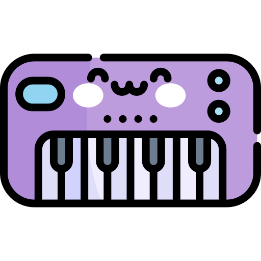

<h1> Teclado Musical </h1>

## Descrição do Projeto

Este projeto é um teclado musical virtual desenvolvido no curso de Javascript para web do programa Oracle Next Education, 
o teclado permite aos usuários tocar notas musicais diretamente do navegador, proporcionando uma experiência interativa.

### Tecnologias utilizadas:

* <b>HTML</b>
* <b>CSS</b>
* <b>Javascript</b>

### Experimente o Teclado Musical:

* [Teclado Musical](https://darthlilac.github.io/teclado-musical/)
